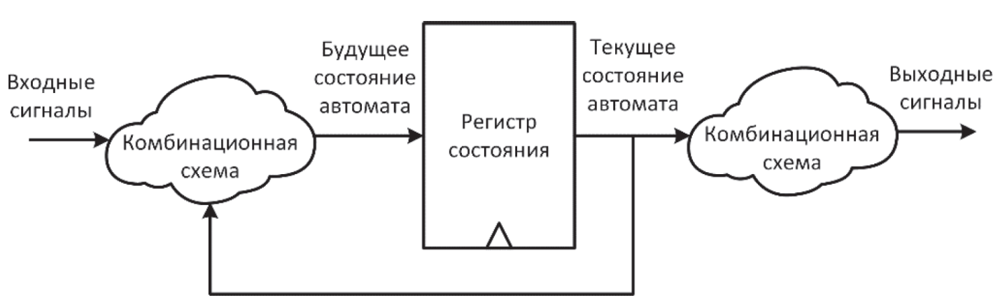
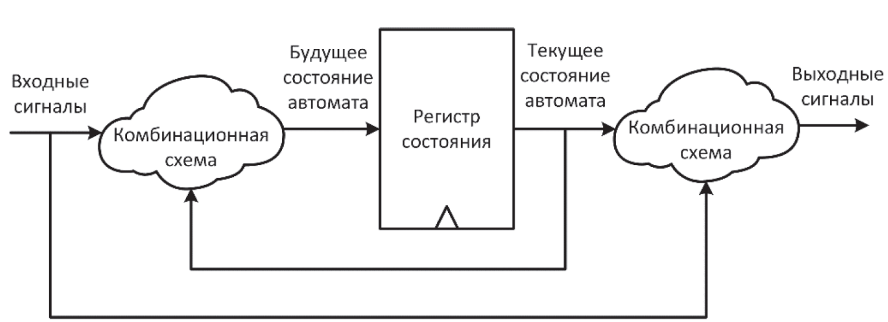
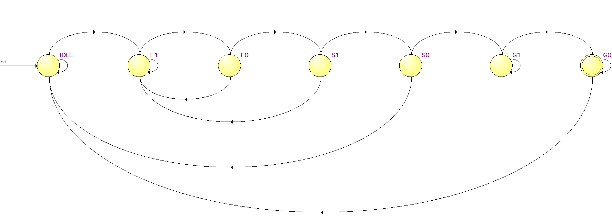
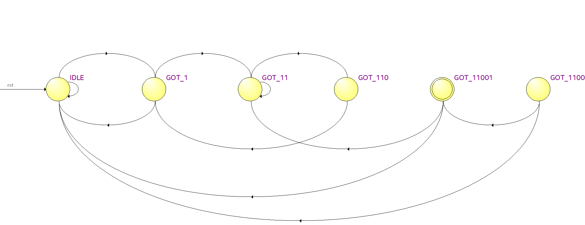
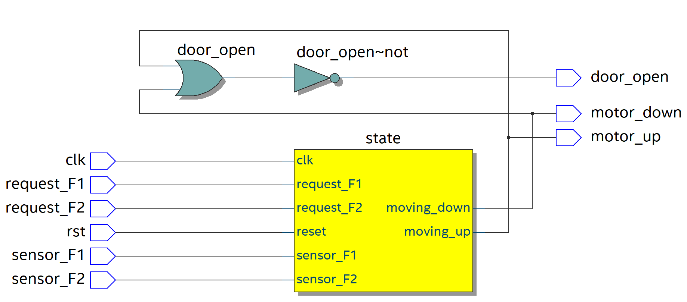
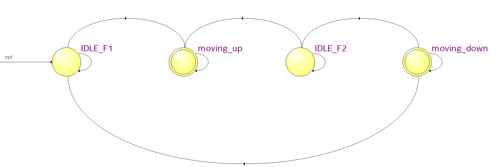
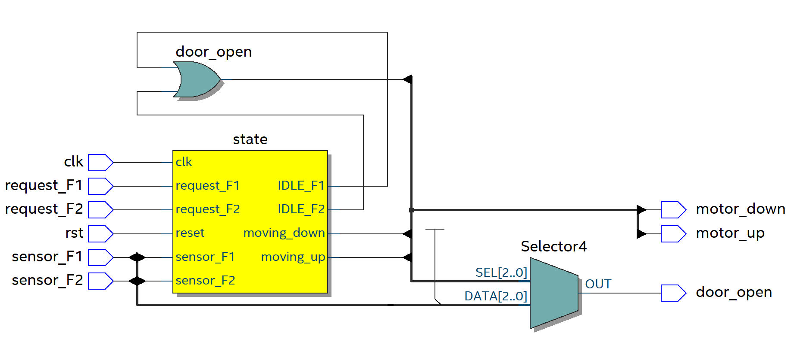
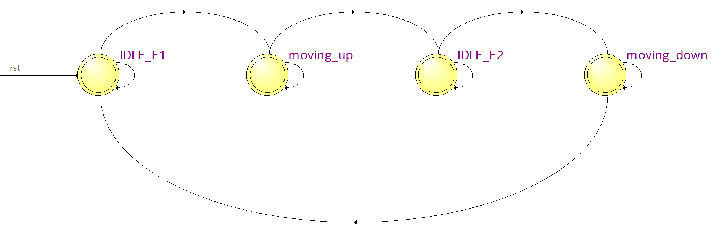
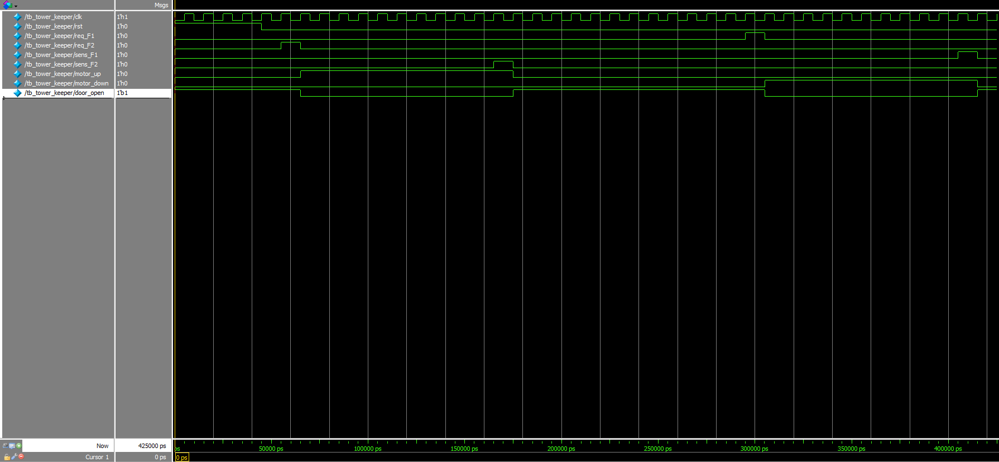

# Finite State Machine

### Содержание
1. [Теория](#Теория)
2. [Решение задач на тему конечных автоматов](#решение-задач)
3. [Тестирование](#Тестирование)


---

## Теория

В цифровой схемотехнике под **конечным автоматом (FSM)** понимают устройство с памятью, которое в любой момент времени находится ровно в одном из ранее известных состояний, и переключается между ними только по строгим правилам в зависимости от входных сигналов.

### Свойства КА:

1. **Конечность (Finiteness)**
> Это свойство означает, что мы всегда знаем, сколько всего ситуаций может возникнуть.

2. **Четкость состояний (Mutually exclusive state)**
> Это свойство означает, что КА всегда находится ровно в одном состоянии в конкретный момент времени.

3. **Предсказуемость (Determinism)**
> Мы всегда можем предсказать, что будет с КА в следующем такте.

4. **Строгость (Rigid Transition Logic)**
> КА всегда строго следует графу переходов.

Возможно, сейчас пока не понятна красота FSM, но на самом деле тут все просто. Это упрощает работу в общем смысле на каждом этапе производства.

### Виды конечных автоматов

В реализации встречаются только два вида конечных автоматов:

> **А. Автомат Мура.**
> Его выходные сигналы зависят *только от текущего состояния*.
 


> **Б. Автомат Мили.**
> Его выходные сигналы зависят *не только от текущего состояния, но и от входящих сигналов*.



При этом, "next state logic" и "output logic" строятся как комбинационные блоки.

Важно так же отметить, что в компании Samsung, например, разделения на автоматы не осуществляется. Т.е они понимаю автомат как комбинационную логику - регистр - комбинационную логику и не важно, есть ли зависимость от входных данных или система зависит только от данных, которые находятся внутри.

---

## Решение задач

Для того, чтобы полнее понять смысл двух реализаций, рассмотрим несколько типовых задач. Я буду решать их для автоматов Мура и Милли в программе **Quartus Prime 21.1**.

### Первая задача
**Задание:** Реализуйте модуль для детектирования 6-ти битной последовательности `110011`, используя конечный автомат.

#### Реализация через автомат Мура

Мы объявляем модуль:

<details>
<summary><b>Показать объявление модуля</b></summary>

```systemverilog
module detect_6_bit_sequence_using_fsm
(
    input clk,
    input rst,
    input a,
    output detected
);
```
</details>

Далее объявляем состояния.

**Enum (enumeration)** — это способ создать свой собственный тип данных. Он нужен для визуализации в симуляторе (Vivado, ModelSim), чтобы упростить чтение языка.

В состоянии `IDLE` наш модуль находится в ожидании последовательности (а именно, в ожидании нужного первого бита последовательности). Последующие состояния — это состояния нашего модуля на каждом из этапов получения числовой последовательности.

<details>
<summary><b>Показать объявление состояний (Enum)</b></summary>

```systemverilog
enum logic[2:0]
{
    IDLE = 3'b000,
    F1   = 3'b001,
    F0   = 3'b010,
    S1   = 3'b011,
    S0   = 3'b100,
    G1   = 3'b101,
    G0   = 3'b110
} state, new_state;

```
</details>
**Enum (enumeration)** — это способ создать свой собственный тип данных. Он нужен для визуализации в симуляторе (Vivado, ModelSim), чтобы упростить чтение языка.

В состоянии `IDLE` наш модуль находится в ожидании последовательности (а именно, в ожидании нужного первого бита последовательности). Последующие состояния — это состояния нашего модуля на каждом из этапов получения числовой последовательности.


Перейдем к описанию **Next State Logic**:

<details>
<summary><b>Показать код (Always Comb)</b></summary>

```systemverilog
always_comb begin
    new_state = state;

    case (state)
        IDLE: if (a)  new_state = F1;
        F1:   if (a)  new_state = F0;
        F0:   if (~a) new_state = S1;
              else    new_state = F1;
        S1:   if (~a) new_state = S0;
              else    new_state = F1;
        S0:   if (a)  new_state = G1;
              else    new_state = IDLE;
        G1:   if (a)  new_state = G0;
              else    new_state = G1;
        G0:   if (a)  new_state = IDLE;
              else    new_state = G0;
    endcase
end
```
</details>
Немножко остановимся на логике состояний подробнее.

Может возникнуть вопрос: Почему когда мы не получаем нужный бит последовательности в состоянии S1 — мы возвращаемся в F1, а если мы в состоянии G1 получаем не нужный бит последовательности — мы отправляемся в IDLE?
**Ответ простой:**
Нам нужна последовательность `110011`. Если в состоянии `F0` (когда мы получили две единицы) мы получаем не ноль, а единицу — это не означает, что следующим битом может прийти не ноль. То есть: в следующем такте уже может прийти ноль.

Для того, чтобы описать все состояния и их переходы, используется диаграмма состояний. К ней также прилагается таблица состояний и переходов.


 
Выглядит она следующим образом:

| Начальное состояние | Конечное состояние | Условие |
| :---: | :---: | :---: |
| F0 | S1 | `~a` |
| F0 | F1 | `a` |
| F1 | F0 | `a` |
| F1 | F1 | `~a` |
| G0 | IDLE | `a` |
| G0 | G0 | `~a` |
| G1 | G1 | `~a` |
| G1 | G0 | `a` |
| IDLE | IDLE | `~a` |
| IDLE | F1 | `a` |
| S0 | IDLE | `~a` |
| S0 | G1 | `a` |
| S1 | S0 | `~a` |
| S1 | F1 | `a` |

Опишем **output logic**:

<details>
<summary><b>Показать код </b></summary>

```systemverilog
assign detected = (state == G0);
```
</details>

Последним этапом будет описание логики обновления состояний:

<details>
  
<summary><b>Показать код </b></summary>
  
  ```systemverilog
  
always_ff @ (posedge clk) begin
    if (rst)
        state <= IDLE;
    else
        state <= new_state;
end

```
</details>

Тогда полный код будет выглядеть следующим образом:
<details>
  
<summary>Конечный автомат FSM </summary>
  
```systemverilog

module detect_6_bit_sequence_using_fsm
(
  input  clk,
  input  rst,
  input  a,
  output detected
);
//объявление состояний
enum logic[2:0]
  {
     IDLE = 3'b000,
     F1   = 3'b001,
     F0   = 3'b010,
     S1   = 3'b011,
     S0   = 3'b100,
	  G1   = 3'b101,
	  G0   = 3'b110
  }
  state, new_state;

//логка переходов
always_comb
  begin
    new_state = state;

    case (state)
      IDLE: if (  a) new_state = F1;
      F1:   if (  a) new_state = F0;
      F0:   if (~ a) new_state = S1;
            else     new_state = F1;
      S1:   if (~ a) new_state = S0;
            else     new_state = F1;
      S0:   if (  a) new_state = G1;
            else     new_state = IDLE;
      G1:   if (  a) new_state = G0;
		      else     new_state = G1;
	    G0:   if (  a) new_state = IDLE;
		      else     new_state = G0;
    endcase
end

	 assign detected = (state == G0);
	 
//обновление состояний 
always_ff @(posedge clk or posedge rst) begin
   if (rst)
	   state <= IDLE;
	else
	   state <= new_state;
end


endmodule

```
</details>
И реализация такого же по функционалу модуля для автомата Милли 

<details>

<summary>Конечный автомат Милли</summary>

```systemverilog

module detect_6_bit_sequence_mealy
(
  input  logic clk,
  input  logic rst,
  input  logic a,
  output logic detected
);


  enum logic [2:0] {
     IDLE     = 3'd0, 
     GOT_1    = 3'd1, 
     GOT_11   = 3'd2, 
     GOT_110  = 3'd3, 
     GOT_1100 = 3'd4, 
     GOT_11001= 3'd5  
  } state, next_state;

  // 1. Логика переходов и выхода (Mealy)
  // Выход зависит от State И от Input 'a' прямо здесь
  always_comb begin
    next_state = state;
    detected   = 1'b0; // По умолчанию ничего не нашли

    case (state)
      IDLE: begin
        if (a) next_state = GOT_1;
        else   next_state = IDLE;
      end

      GOT_1: begin
        if (a) next_state = GOT_11;
        else   next_state = IDLE; 
      end

      GOT_11: begin
        if (~a) next_state = GOT_110; 
        else    next_state = GOT_11; 
      end

      GOT_110: begin
        if (~a) next_state = GOT_1100;
        else    next_state = GOT_1;  
		end

      GOT_1100: begin
        if (a) next_state = GOT_11001;
        else   next_state = IDLE; 
      end

      GOT_11001: begin
        // Логика Мили
        if (a) begin 
            // Пришла 1! Мы собрали 11001 + 1 = 110011!
            detected = 1'b1; 
            
            
            // Мы получили ...110011. Конец "11" может быть началом новой
            next_state = GOT_11; 
        end else begin
            // Пришел 0. ...110010. Сброс.
            next_state = IDLE; 
        end
      end
      
      default: next_state = IDLE;
    endcase
  end

  // 2. Обновление состояния 
  always_ff @(posedge clk or posedge rst) begin
    if (rst) state <= IDLE;
    else     state <= next_state;
  end

endmodule

```
  
</details>



| Текущее состояние | Конечное состояние | Условие |
| :---: | :---: | :---: |
| GOT_1 | GOT_11 | `a` |
| GOT_1 | IDLE | `~a` |
| GOT_11 | GOT_11 | `a` |
| GOT_11 | GOT_110 | `~a` |
| GOT_110 | GOT_1 | |
| GOT_1100 | GOT_11001 | `a` |
| GOT_1100 | IDLE | `~a` |
| GOT_11001 | GOT_11 | `a` |
| GOT_11001 | IDLE | `~a` |
| IDLE | GOT_1 | `a` |
| IDLE | IDLE | `~a` |

Автомат Мили реагирует быстрее (асинхронно внутри такта) и часто требует меньше регистров, но его выход может "глитчить" (дребезжать), если входной сигнал нестабилен, так как между входом и выходом нет регистра.

Вторую часть нашей лекции я хочу посвятить более интересной и творческой задаче.

## Tower keeper

Представьте себе частную двухэтажную библиотеку. Чтобы перемещаться между этажами, её эксцентричный владелец установил небольшой лифт. Ваша задача — спроектировать "мозг" этого лифта. Система должна быть достаточно умной, чтобы не просто двигаться вверх-вниз, а реагировать на вызовы с этажей и безопасно доставлять своего единственного пассажира.

Эту задачу я считаю творческой по той причине, что усложнять свой проект можно до бесконечности, реализуя свои мысли.
Но чтобы лишний раз не усложнять себе жизнь, я дополню ее:
Лифт должен:
1. Стоять на любом из этажей с открытыми дверьми и ждать, пока в нем не нажмут кнопку.
2. Ехать вверх или вниз. (зависит от того, на каком этаже сам лифт)
3. Реагировать на вызовы с этажей.
4. Открывать и закрывать двери.

От чего "Мозг" получает информацию?
1. От кнопок, которые располагаются на этажах
2. Т.к в условии задачи сказано, что система должна быть умной, чтобы реагировать на вызовы этажей - логично предположить, что на этажах располагаются сенсоры. От них он и получает информацию.


<details>
	  
<summary><b>input "мозга" на Verilog</b></summary>

```systemverilog

input clk,
input rst,
input request_F1,
input request_F2,
input sensor_F1,
input sensor_F2,

```

</details>


Удобно так же определиться с основным функционалом нашего "Мозга":
1. Он должен управлять дверьми
2. Указывать мотору, двигаться вверх или вниз.
3. Т.к в условии задачи сказано, что система должна быть умной, чтобы реагировать на вызовы этажей - логично предположить, что на этажах располагаются сенсоры, получая сигнал от которых, лифт останавливается и открывает двери.


<details>
		 
<summary><b>output "мозга" на verilog</b></summary>

   ```systemverilog

  output reg motor_up,
  output reg motor_down,
  output reg door_open

   ```

</details>


После того, как мы определились с основной задачей нашего лифта, удобно определиться и с основными состояниями конечного автомата.
1. Он ждет на первом этаже. Это первое состояние.
2. Лифт едет на второй этаж. Это второе состояние.
3. Лифт ждет на втором этаже. Это третье состояние.
4. Лифт едет на первый этаж. Это четвертое состояние.


<details>
	
<summary><b>Реализация на verilog</b></summary>

```systemverilog
	
localparam IDLE_F1     = 2'd0;
localparam moving_up   = 2'd1;
localparam IDLE_F2     = 2'd2;
localparam moving_down = 2'd3;

reg [1:0] state, next_state;

```
	
</details>

Прекрасно. После решения всех этих вопросов, можно переходить к описанию логики состояний нашего конечного автомата.

Он должен:

1.По дефолту находится на одном из этажей. Вы можете выбрать любой из них.

<details>
	
<summary><b>Реализация на verilog</b></summary>

```systemverilog

    default: begin next_state = IDLE_F1;
end

```
	
</details>

2.Быть в состоянии движения при получении запроса с этажа.

<details>
	
<summary><b>Реализация на verilog</b></summary>

```systemverilog

   IDLE_F1 : begin if (request_F2) begin next_state = moving_up;
	 
end

```
	
</details>


3.Останавливаться, при получении сигнала от сенсора.

<details>
	
<summary><b>Реализация на verilog</b></summary>

```systemverilog

   moving_up: begin if (sensor_F2) begin next_state = IDLE_F2;
	 
end

```
	
</details>

остальные состояния вы можете написать сами по аналогии.

Перейдем к описанию логики выходов.

1.Находясь в состоянии движения, двигатель должен поднимать или опускать лифт.

2.Находясь в состоянии ожидания, двери лифта должны быть открыты.

<details>
	
<summary><b>Реализация на verilog</b></summary>

```systemverilog

   always @(*) begin
	motor_up = 1'b0;
	motor_down = 1'b0;
	door_open = 1'b0;
	
		  case (state) 
		  
					 moving_up : begin  motor_up = 1'b1;
		 
			  end
		 
		 
		 
					 IDLE_F2 : begin  door_open = 1'b1;
		 
			  end
		 
		  
		  
					 moving_down : begin  motor_down = 1'b1;
		 
			  end
		 
		  
		  
					 IDLE_F1 : begin  door_open = 1'b1;
		 
			  end
		 
		
		 
		 
	  endcase
	end

```
	
</details>


<details>
	
<summary><b>Описание всего автомата на verilog</b></summary>

```systemverilog

   module tower_keeper_moore(
input clk,
input rst,
input request_F1,
input request_F2,
input sensor_F1,
input sensor_F2,
output reg motor_up,
output reg motor_down,
output reg door_open
);

localparam IDLE_F1     = 2'd0;
localparam moving_up   = 2'd1;
localparam IDLE_F2     = 2'd2;
localparam moving_down = 2'd3;

reg [1:0] state, next_state;

always @(*) begin
      next_state = state;
		
       case(state) 
	 
	          IDLE_F1 : begin if (request_F2) begin next_state = moving_up;
	 
	     end
	 end
	 
	  
	 
	           moving_up: begin if (sensor_F2) begin next_state = IDLE_F2;
	 
	     end
	 end
	 
	 
	           IDLE_F2: begin if (request_F1) begin next_state = moving_down;
	 
	     end
	 end
	 
	 
	           moving_down: begin if (sensor_F1) begin next_state = IDLE_F1;
	 
	     end
	 end
	 
	 
	           default: begin next_state = IDLE_F1;
	 
	     end
	 endcase
end


always @(posedge clk or posedge rst) begin

      if (rst) begin
		
		state <= IDLE_F1;
		
		end else begin
		
		state <= next_state;
	end
end

	always @(*) begin
	motor_up = 1'b0;
	motor_down = 1'b0;
	door_open = 1'b0;
	
		  case (state) 
		  
					 moving_up : begin  motor_up = 1'b1;
		 
			  end
		 
		 
		 
					 IDLE_F2 : begin  door_open = 1'b1;
		 
			  end
		 
		  
		  
					 moving_down : begin  motor_down = 1'b1;
		 
			  end
		 
		  
		  
					 IDLE_F1 : begin  door_open = 1'b1;
		 
			  end
		 
		
		 
		 
	  endcase
	end

endmodule

```
	
</details>
Открываем RTL viewer и наблюдаем вот такую картину



Также можем посмотреть на таблицу и диаграмму состояний:




| Текущее состояние | Конечное состояние | Условие |
| :---: | :---: | :---: |
| IDLE_F1     | IDLE_F1     | `~request_F2` |
|IDLE_F1      | moving_up   | `request_F2` |
| IDLE_F2     | IDLE_F2     | `~request_F1` |
| IDLE_F2     | moving_down | `request_F1` |
| moving_down | IDLE_F1     |`sensor_F1`|
| moving_down | moving_down | `~sensor_F1` |
| moving_up   | IDLE_F2     | `sensor_F2` |
| moving_up   |moving_up    |`~sensor_F2 `|

Для автомата Милли Все, кроме логики выходов, будет то же самое.

<details>
	
<summary><b>Реализация выходной логики на verilog</b></summary>

```systemverilog

   //логика выходов для автомата Милли
	always @(*) begin
	motor_up = 1'b0;
	motor_down = 1'b0;
	door_open = 1'b0;
	
		  case (state) 
		  
					 moving_up : begin  motor_up = 1'b1;
					 
					 
					 if (sensor_F2) begin
					 door_open = 1'b1;
					end
		 
			  end
		 
		 
		 
					 IDLE_F2 : begin  door_open = 1'b1;
		 
			  end
		 
		  
		  
					 moving_down : begin  motor_down = 1'b1;
					 
					 if (sensor_F1) begin
					 door_open = 1'b1;
					end
		 
			  end
		 
		  
		  
					 IDLE_F1 : begin  door_open = 1'b1;
		 
			  end
		 
		
		 
		 
	  endcase
	end

```
	
</details>

Открываем RTL viewer и смотрим на полученную схему



Таблица и диаграмма состояний:



| Текущее состояние | Конечное состояние | Условие |
| :---: | :---: | :---: |
| IDLE_F1     | IDLE_F1     | `~request_F2` |
|IDLE_F1      | moving_up   | `request_F2` |
| IDLE_F2     | IDLE_F2     | `~request_F1` |
| IDLE_F2     | moving_down | `request_F1` |
| moving_down | IDLE_F1     |`sensor_F1`|
| moving_down | moving_down | `~sensor_F1` |
| moving_up   | IDLE_F2     | `sensor_F2` |
| moving_up   |moving_up    |`~sensor_F2 `|

## Тестирование
Для тестирования мы будем использовать тестбенч, который был ранее написан нашей командой. Тестировть будем в программе modelsim

<details>
	
<summary><b>Test Bench file</b></summary>

```systemverilog

 `timescale 1ns / 1ps

module tb_tower_keeper;

  
  logic clk;
  logic rst;
  logic req_F1;
  logic req_F2;
  

  logic sens_F1;
  logic sens_F2;
  

  logic motor_up;
  logic motor_down;
  logic door_open;

  tower_keeper_moore DUT (
    .clk(clk),
    .rst(rst),
    .request_F1(req_F1),
    .request_F2(req_F2),
    .sensor_F1(sens_F1),
    .sensor_F2(sens_F2),
    .motor_up(motor_up),
    .motor_down(motor_down),
    .door_open(door_open)
  );

  initial begin
    clk = 0;
    forever #5 clk = ~clk;
  end

  initial begin
    $dumpfile("elevator.vcd");
    $dumpvars(0, tb_tower_keeper);
    
    rst = 1;
    req_F1 = 0; req_F2 = 0;
    sens_F1 = 0; sens_F2 = 0; 
    
    repeat(5) @(posedge clk);
    rst = 0;
   
    
    // --- СЦЕНАРИЙ 1: Поездка на 2 этаж ---
   
    @(posedge clk);
    req_F2 = 1; 
    @(posedge clk);
    req_F2 = 0; 
    
    // Теперь ждем реакции мотора
    wait(motor_up == 1); 
  
    
   
    repeat(10) @(posedge clk); 
    
    // Лифт доехал до датчика 2 этажа
   
    sens_F2 = 1; 
    @(posedge clk); 
    sens_F2 = 0; // Лифт проехал датчик и встал (или датчик сработал импульсно)
    
    // Проверка: Мотор должен встать, двери открыться
    @(posedge clk); // Даем такт на реакцию
    

    // Пауза "на этаже" (пассажир выходит)
    repeat(10) @(posedge clk);

    // --- СЦЕНАРИЙ 2: Возвращение на 1 этаж ---
   
    @(posedge clk);
    req_F1 = 1;
    @(posedge clk);
    req_F1 = 0;
    
    wait(motor_down == 1);
   
    
    repeat(10) @(posedge clk); // Едем вниз
    
   
    sens_F1 = 1;
    @(posedge clk);
    sens_F1 = 0;
    
    @(posedge clk);
   

    $finish;
  end

  // --- Мониторинг для отладки в консоли ---
  // Сакана любит всё контролировать
  initial begin
    $monitor("Time=%0t | State=%d | UP=%b DWN=%b DOOR=%b | Req F2=%b Sens F2=%b", 
             $time, DUT.state, motor_up, motor_down, door_open, req_F2, sens_F2);
  end

endmodule

```
	
</details>


Результаты Вы можете видеть на экране. Объектом тестирования был конечный автомат Мура.


Как видно из картинки - все работает. Мы успешно завершаем нашу первую лекци по конечным автоматам. 
